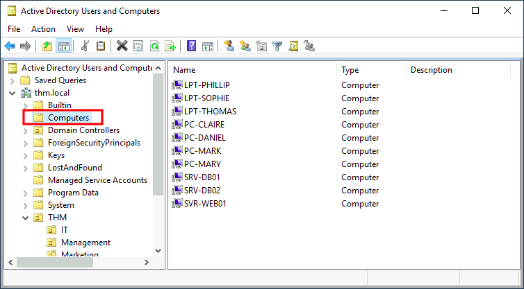

# Managing Computers

By default, all the machines that join a domain (except for the DCs) will be put in the container called "Computers". If we check our DC, we will see that some devices are already there:

We can see some servers, some laptops and some PCs corresponding to the users in our network. Having all of our devices there is not the best idea since it's very likely that you want different policies for your servers and the machines that regular users use on a daily basis.

While there is no golden rule on how to organise your machines, an excellent starting point is segregating devices according to their use. In general, you'd expect to see devices divided into at least the three following categories:

**1. Workstations**

Workstations are one of the most common devices within an Active 
Directory domain. Each user in the domain will likely be logging into a 
workstation. This is the device they will use to do their work or normal
 browsing activities. These devices should never have a privileged user 
signed into them.

**2. Servers**

Servers are the second most common device within an Active Directory 
domain. Servers are generally used to provide services to users or other
 servers.

**3. Domain Controllers**

Domain Controllers are the third most common device within an Active 
Directory domain. Domain Controllers allow you to manage the Active 
Directory Domain. These devices are often deemed the most sensitive 
devices within the network as they contain hashed passwords for all user
 accounts within the environment.