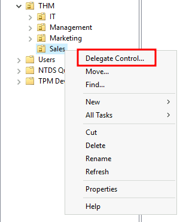

# delegation

One of the nice things you can do in AD is to give specific users some control over some OUs. This process is known as **delegation** and
 allows you to grant users specific privileges to perform advanced tasks
 on OUs without needing a Domain Administrator to step in.

One of the most common use cases for this is granting `IT support`
 the privileges to reset other low-privilege users' passwords. According
 to our organisational chart, Phillip is in charge of IT support, so 
we'd probably want to delegate the control of resetting passwords over 
the Sales, Marketing and Management OUs to him.

For this example, we will delegate control over the Sales OU to 
Phillip. To delegate control over an OU, you can right-click it and 
select **Delegate Control**:

This should open a new window where you will first be asked for the users to whom you want to delegate control:

**Note:** To avoid mistyping the user's name, write "phillip" and click the **Check Names** button. Windows will autocomplete the user for you.

Click OK, and on the next step, select the following option:

