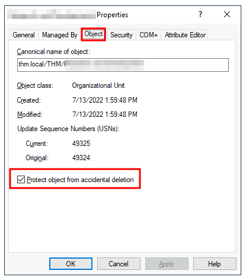

# deleting OUs

By default, OUs are protected against accidental deletion. To delete the OU, we need to enable the **Advanced Features** in the View menu:

This will show you some additional containers and enable you to disable the accidental deletion protection. To do so, right-click the OU and go to Properties. You will find a checkbox in the Object tab to disable the protection:

Be sure to uncheck the box and try deleting the OU again. You will be prompted to confirm that you want to delete the OU, and as a result, any users, groups or OUs under it will also be deleted.

After deleting the extra OU, you should notice that for some of the departments, the users in the AD don't match the ones in our organisational chart. Create and delete users as needed to match them.