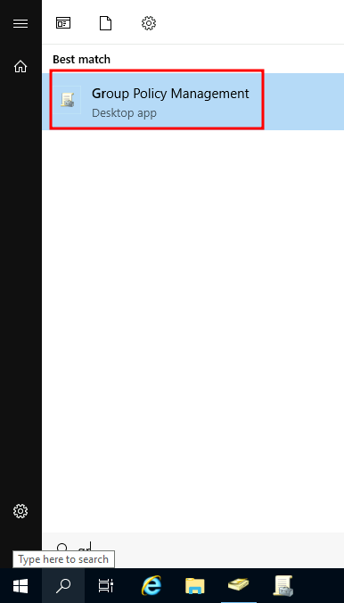

# Configure GPOs

To configure GPOs, you can use the **Group Policy Management** tool, available from the start menu:

The first thing you will see when opening it is your complete OU 
hierarchy, as defined before. To configure Group Policies, you first 
create a GPO under **Group Policy Objects** and then link 
it to the GPO where you want the policies to apply. As an example, you 
can see there are some already existing GPOs in your machine:

We can see in the image above that 3 GPOs have been created. From those, the `Default Domain Policy` and `RDP Policy` are linked to the `thm.local` domain as a whole, and the `Default Domain Controllers Policy` is linked to the `Domain Controllers`
 OU only. Something important to have in mind is that any GPO will apply
 to the linked OU and any sub-OUs under it. For example, the `Sales` OU will still be affected by the `Default Domain Policy`.

Let's examine the `Default Domain Policy` to see what's inside a GPO. The first tab you'll see when selecting a GPO shows its **scope**, which is where the GPO is linked in the AD. For the current policy, we can see that it has only been linked to the `thm.local` domain:

As you can see, you can also apply **Security Filtering** to GPOs so that they are only applied to specific users/computers under an OU. By default, they will apply to the **Authenticated Users** group, which includes all users/PCs.

The **Settings** tab includes the actual contents of the
 GPO and lets us know what specific configurations it applies. As stated
 before, each GPO has configurations that apply to computers only and 
configurations that apply to users only. In this case, the `Default Domain Policy` only contains Computer Configurations:

Feel free to explore the GPO and expand on the available items using the
 "show" links on the right side of each configuration. In this case, the
 `Default Domain Policy`
 indicates really basic configurations that should apply to most domains, including password and account lockout policies:

Since this GPO applies to the whole domain, any change to it would 
affect all computers. Let's change the minimum password length policy to
 require users to have at least 10 characters in their passwords. To do 
this, right-click the GPO and select **Edit**:

This will open a new window where we can navigate and edit all the 
available configurations. To change the minimum password length, go to `Computer
 Configurations -> Policies -> Windows Setting -> Security 
Settings -> Account Policies -> Password Policy` and change the required policy value:

As you can see, plenty of policies can be established in a GPO. While
 explaining every single of them would be impossible in a single room, 
do feel free to explore a bit, as some of the policies are 
straightforward. If more information on any of the policies is needed, 
you can double-click them and read the **Explain** tab on each of them:

